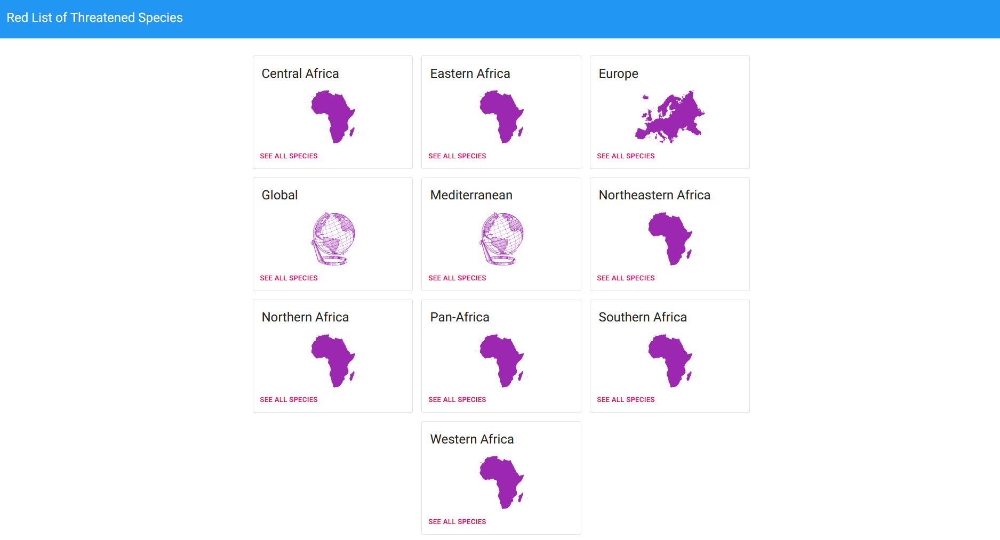

# Red List of Threatened Species

## Details

React app that is using data provided by [The International Union for Conservation of Nature’s Red List of Threatened Species](https://www.iucnredlist.org/) to display the species that are threatened.

## Install

### Prerequisites

- Node JS
- Yarn
- Api token from [here](https://apiv3.iucnredlist.org/api/v3/token)

#### Clone this repo

`git clone git@github.com:RazvanRauta/threatened_species.git`

### Install dependencies

`cd threatened_species && yarn`

### Add token

Add your token in the [.env](./.env) file:

`REACT_APP_API_TOKEN=token here`

## Run project locally

In the root folder run:

`yarn start`

the app will start on `http://localhost:3000`

## Build project

In the root folder run:

`yarn build`

## Demo

### [redlist.rrazvan.dev](https://redlist.rrazvan.dev/)
